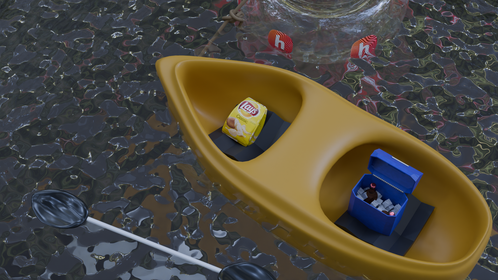

# Ship Render

This is a simple render I did of a boat on a lake. It's just a quiet little render supposed to capture the carefree days of hanging out by the water. It's all textured by me, with an image of potato chips from google, stickers from hackclub, and an hdri from blenderkit, everything else is procedureally textured.

